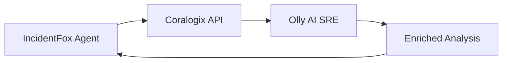

## Overview

Coralogix is a full-stack observability platform. IncidentFox integrates with Coralogix to:

- Search logs across applications and subsystems
- Query metrics for anomaly detection
- Access alert history and context
- Integrate with Olly (Coralogix's AI SRE agent)

## Prerequisites

- Coralogix account with API access
- API key with read permissions
- Knowledge of your Coralogix domain

## Configuration

### Step 1: Generate API Key

1. Log in to your Coralogix dashboard
2. Navigate to **Data Flow** > **API Keys**
3. Click **Generate New Key**
4. Select scopes:
   - `logs:read`
   - `metrics:read`
   - `alerts:read`
5. Copy the generated key

<Warning>
Store the API key immediately - it won't be shown again.
</Warning>

### Step 2: Identify Your Domain

Coralogix has regional domains:

| Region | Domain |
|--------|--------|
| US | `coralogix.com` |
| EU | `eu2.coralogix.com` |
| India | `app.coralogix.in` |
| Singapore | `coralogixsg.com` |

### Step 3: Add to IncidentFox

**Via Web UI:**

1. Go to **Team Console** > **Integrations**
2. Click **Add Integration** > **Coralogix**
3. Enter:
   - API Key
   - Domain
   - Default Application (optional)
   - Default Subsystem (optional)
4. Click **Test Connection**
5. Save

**Via Configuration:**

```json
{
  "tools": {
    "coralogix": {
      "enabled": true,
      "api_key": "vault://secrets/coralogix-api-key",
      "domain": "coralogix.com",
      "default_application": "production",
      "default_subsystem": "backend"
    }
  }
}
```

## Available Tools

Once configured, these tools become available:

### `search_coralogix_logs`

Search logs with Lucene query syntax.

```
@incidentfox search coralogix logs for "error" AND "payments" in the last hour
```

**Parameters:**
- `query` - Lucene query string
- `application` - Application filter (optional)
- `subsystem` - Subsystem filter (optional)
- `time_range` - Time range (default: 1 hour)

### `get_coralogix_metrics`

Query metrics data.

```
@incidentfox get coralogix metrics for request_latency_p99 in payments service
```

**Parameters:**
- `metric_name` - Name of the metric
- `filters` - Label filters
- `aggregation` - Sum, avg, max, min, etc.
- `time_range` - Time range for query

### `get_coralogix_alerts`

Retrieve recent alerts.

```
@incidentfox show coralogix alerts for the last 24 hours
```

**Parameters:**
- `severity` - Filter by severity (optional)
- `status` - Active, resolved, all
- `time_range` - Time range

### `get_coralogix_traces`

Get distributed traces for a service.

```
@incidentfox get traces for the checkout flow with high latency
```

**Parameters:**
- `service` - Service name
- `operation` - Operation/endpoint (optional)
- `min_duration` - Minimum trace duration
- `time_range` - Time range

## Olly Integration

Coralogix's AI SRE agent, Olly, can work alongside IncidentFox for enhanced investigations.

### How It Works



IncidentFox can:
1. Query Coralogix data directly
2. Request Olly's analysis of specific issues
3. Combine Olly's insights with data from other sources

### Enabling Olly Integration

```json
{
  "tools": {
    "coralogix": {
      "enabled": true,
      "api_key": "vault://secrets/coralogix-api-key",
      "domain": "coralogix.com",
      "olly_enabled": true
    }
  }
}
```

### Example: Combined Investigation

```
@incidentfox investigate high error rates in the checkout service, use Olly for analysis
```

IncidentFox will:
1. Query Coralogix logs for errors
2. Ask Olly to analyze the error patterns
3. Correlate with metrics from other sources
4. Provide combined findings

## Use Cases

### Log Search During Incidents

```
@incidentfox search coralogix for exceptions in payments-service since the alert fired
```

IncidentFox will:
- Query recent logs matching the criteria
- Identify error patterns
- Correlate with recent deployments

### Metrics Correlation

```
@incidentfox check if latency spike in coralogix correlates with database connection issues
```

### Alert Investigation

```
@incidentfox get context for the latest coralogix alert on cart-service
```

## Troubleshooting

### Connection Failed

**Symptom:** "Unable to connect to Coralogix API"

**Solutions:**
1. Verify API key is valid and not expired
2. Check domain is correct for your region
3. Ensure network allows outbound HTTPS to Coralogix

### Empty Results

**Symptom:** Queries return no data

**Solutions:**
1. Verify application/subsystem names are correct
2. Check time range - data may be outside the range
3. Verify the query syntax (Lucene format)

### Rate Limiting

**Symptom:** "Rate limit exceeded" errors

**Solutions:**
1. Reduce query frequency
2. Use more specific queries
3. Contact Coralogix to increase limits

## Best Practices

<Tip>
**Use application and subsystem filters** to narrow results and improve query performance.
</Tip>

1. **Set default filters** in configuration to reduce noise
2. **Use specific time ranges** - don't query more data than needed
3. **Leverage Olly** for pattern recognition in large log volumes
4. **Combine with other sources** - Coralogix for logs, Grafana for metrics

## Security Considerations

- API keys should have **read-only** permissions
- Store keys in your secrets manager
- Rotate keys periodically
- Monitor API usage for anomalies

## Next Steps

<CardGroup cols={2}>
  <Card title="Snowflake" icon="snowflake" href="/data-sources/snowflake">
    Enrich with historical data
  </Card>
  <Card title="AWS" icon="aws" href="/data-sources/aws">
    Connect AWS CloudWatch
  </Card>
</CardGroup>
