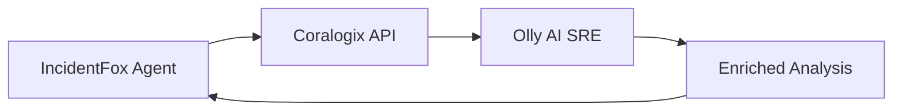

<iframe
  width="560"
  height="315"
  src="https://www.youtube.com/embed/he5QrFKymAg"
  title="Integrating Coralogix with Slack"
  frameborder="0"
  allow="accelerometer; autoplay; clipboard-write; encrypted-media; gyroscope; picture-in-picture"
  allowfullscreen
></iframe>

## Overview

Coralogix is a full-stack observability platform. IncidentFox integrates with Coralogix to:

- Search logs across applications and subsystems
- Query metrics for anomaly detection
- Access alert history and context
- Integrate with Olly (Coralogix's AI SRE agent)

## Prerequisites

- Coralogix account with API access
- API key with read permissions
- Knowledge of your Coralogix domain

## Configuration

### Step 1: Create a Coralogix API Key

1. Log in to your Coralogix dashboard
2. Navigate to **Settings** (left navbar) > **API Keys**
3. Click **+ Team Key** (bottom right)
4. Configure the key:
   - **Key name:** `IncidentFox` (or any descriptive name)
   - **Role Presets:** Select `DataQuerying`
5. Click **Create**
6. Copy the API key

### Step 2: Identify Your Domain

Your Coralogix domain is shown in your browser URL when logged in (e.g., `app.eu2.coralogix.com`).

Coralogix regional domains:

| Region | Team Login URL |
|--------|----------------|
| EU1 (Ireland) | `coralogix.com` |
| EU2 (Stockholm) | `app.eu2.coralogix.com` |
| US1 (Ohio) | `app.coralogix.us` |
| US2 (Oregon) | `app.cx498.coralogix.com` |
| AP1 (India) | `app.coralogix.in` |
| AP2 (Singapore) | `app.coralogixsg.com` |
| AP3 (Jakarta) | `app.ap3.coralogix.com` |

### Step 3: Connect to IncidentFox

<Tip>
See [Configuring Data Sources](/integrations/slack#configuring-data-sources) for general instructions on opening the configuration panel in Slack.
</Tip>

1. Open the IncidentFox app in Slack (click the bot's avatar → **Open App**)
2. Under **Available Integrations**, find Coralogix and click **Connect** (or **Edit** if already configured)
3. In the modal:
   - Watch the **video walkthrough** for step-by-step guidance
   - Paste your **API Key**
   - Select your **Domain** from the dropdown (based on your Coralogix URL)
   - Optionally, add **Custom Context** to help the AI understand your Coralogix setup (e.g., application names, team conventions, important subsystems)
4. Click **Save**

### Custom Context for AI (Optional)

The **Context for AI** field lets you provide additional information that helps IncidentFox investigate more effectively. Examples:

- "Our main applications are `payments-api` and `checkout-service`"
- "Production logs use subsystem `prod-backend`, staging uses `staging-backend`"
- "Critical alerts come from the `sre-alerts` application"

This context is provided to the AI during investigations to help it query the right data.

## Available Tools

Once configured, these tools become available:

### `search_coralogix_logs`

Search logs with Lucene query syntax.

```
@incidentfox search coralogix logs for "error" AND "payments" in the last hour
```

**Parameters:**
- `query` - Lucene query string
- `application` - Application filter (optional)
- `subsystem` - Subsystem filter (optional)
- `time_range` - Time range (default: 1 hour)

### `get_coralogix_metrics`

Query metrics data.

```
@incidentfox get coralogix metrics for request_latency_p99 in payments service
```

**Parameters:**
- `metric_name` - Name of the metric
- `filters` - Label filters
- `aggregation` - Sum, avg, max, min, etc.
- `time_range` - Time range for query

### `get_coralogix_alerts`

Retrieve recent alerts.

```
@incidentfox show coralogix alerts for the last 24 hours
```

**Parameters:**
- `severity` - Filter by severity (optional)
- `status` - Active, resolved, all
- `time_range` - Time range

### `get_coralogix_traces`

Get distributed traces for a service.

```
@incidentfox get traces for the checkout flow with high latency
```

**Parameters:**
- `service` - Service name
- `operation` - Operation/endpoint (optional)
- `min_duration` - Minimum trace duration
- `time_range` - Time range

## Olly Integration

Coralogix's AI SRE agent, Olly, can work alongside IncidentFox for enhanced investigations.

### How It Works



IncidentFox can:
1. Query Coralogix data directly
2. Request Olly's analysis of specific issues
3. Combine Olly's insights with data from other sources

### Example: Combined Investigation

```
@incidentfox investigate high error rates in the checkout service, use Olly for analysis
```

IncidentFox will:
1. Query Coralogix logs for errors
2. Ask Olly to analyze the error patterns
3. Correlate with metrics from other sources
4. Provide combined findings

## Use Cases

### Log Search During Incidents

```
@incidentfox search coralogix for exceptions in payments-service since the alert fired
```

IncidentFox will:
- Query recent logs matching the criteria
- Identify error patterns
- Correlate with recent deployments

### Metrics Correlation

```
@incidentfox check if latency spike in coralogix correlates with database connection issues
```

### Alert Investigation

```
@incidentfox get context for the latest coralogix alert on cart-service
```

## Troubleshooting

### Connection Failed

**Symptom:** "Unable to connect to Coralogix API"

**Solutions:**
1. Verify API key is valid and not expired
2. Check domain is correct for your region
3. Ensure network allows outbound HTTPS to Coralogix

### Empty Results

**Symptom:** Queries return no data

**Solutions:**
1. Verify application/subsystem names are correct
2. Check time range - data may be outside the range
3. Verify the query syntax (Lucene format)

### Rate Limiting

**Symptom:** "Rate limit exceeded" errors

**Solutions:**
1. Reduce query frequency
2. Use more specific queries
3. Contact Coralogix to increase limits

## Best Practices

<Tip>
**Use application and subsystem filters** to narrow results and improve query performance.
</Tip>

1. **Set default filters** in configuration to reduce noise
2. **Use specific time ranges** - don't query more data than needed
3. **Leverage Olly** for pattern recognition in large log volumes
4. **Combine with other sources** - Coralogix for logs, Grafana for metrics

## Security Considerations

### What IncidentFox Can Access

The `DataQuerying` preset grants these **read-only** capabilities:

| Permission | Purpose |
|------------|---------|
| Query Data from the Archive | Search historical data |
| Query Frequent Search Logs | Search and analyze log data |
| Query Monitoring & Compliance Logs | Query compliance-tier logs |
| Query Metrics | Correlate metrics with incidents |
| Query Frequent Search Spans | Trace requests across services |
| Query Monitoring & Compliance Spans | Query compliance-tier traces |
| View CPU profiling data | View profiling information |

### What IncidentFox Cannot Do

- Create, modify, or delete alerts
- Change any Coralogix configurations
- Access team admin settings
- Manage API keys or users
- Send or ingest data

### Best Practices

- **All permissions are read-only** - no write or management access
- **You control the key** - revoke anytime from your Coralogix dashboard
- **No data storage** - IncidentFox queries on-demand; logs stay in Coralogix
- Store keys in your secrets manager
- Rotate keys periodically
- Monitor API usage for anomalies

### Revoking Access

To revoke IncidentFox's access at any time:

1. Go to **Settings** > **API Keys** in your Coralogix dashboard
2. Find the `IncidentFox` key
3. Click **Delete**

## Next Steps

<CardGroup cols={2}>
  <Card title="Snowflake" icon="snowflake" href="/data-sources/snowflake">
    Enrich with historical data
  </Card>
  <Card title="AWS" icon="aws" href="/data-sources/aws">
    Connect AWS CloudWatch
  </Card>
</CardGroup>
