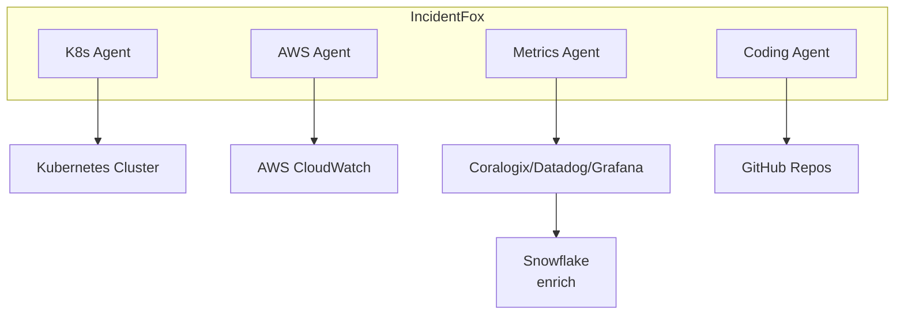

## Overview

IncidentFox connects to your existing observability and data platforms to investigate incidents. This section covers how to configure each data source.

## Supported Data Sources

### Observability Platforms

| Platform | Status | Capabilities |
|----------|--------|--------------|
| [Coralogix](/data-sources/coralogix) | Supported | Log search, metrics, alerts, Olly integration |
| [Datadog](/data-sources/datadog) | Supported | Metrics, logs, APM traces |
| [Grafana](/data-sources/grafana) | Supported | Prometheus queries, dashboards, alerts |
| New Relic | Supported | NRQL queries, APM summary |
| Elasticsearch | Supported | Log search, aggregations |

### Cloud Providers

| Platform | Status | Capabilities |
|----------|--------|--------------|
| [AWS](/data-sources/aws) | Supported | CloudWatch, EC2, Lambda, RDS, ECS, CodePipeline |
| GCP | Roadmap | Cloud Logging, GKE, Cloud Run |
| Azure | Roadmap | Monitor, AKS, Functions |

### Infrastructure

| Platform | Status | Capabilities |
|----------|--------|--------------|
| [Kubernetes](/data-sources/kubernetes) | Supported | Pod logs, events, deployments, metrics |
| Docker | Supported | Container logs, exec, compose |

### Data & CI/CD

| Platform | Status | Capabilities |
|----------|--------|--------------|
| [Snowflake](/data-sources/snowflake) | Supported | SQL queries, data enrichment |
| GitHub | Supported | Code search, PRs, Actions, webhooks |
| Confluence | Supported | Documentation search |
| Google Docs | Supported | Runbook search |

## Data Source Architecture



## Credential Management

All credentials should be stored securely using vault references:

```json
{
  "tools": {
    "coralogix": {
      "api_key": "vault://secrets/coralogix-api-key"
    }
  }
}
```

<Warning>
Never store credentials in plain text in configuration files.
</Warning>

### Vault Reference Format

```
vault://path/to/secret
```

IncidentFox supports:
- AWS Secrets Manager
- HashiCorp Vault
- Environment variables (for development)

## Quick Setup

<Steps>
  <Step title="Choose Your Data Sources">
    Identify which platforms you want IncidentFox to access
  </Step>
  <Step title="Create API Keys">
    Generate read-only API keys for each platform
  </Step>
  <Step title="Store in Vault">
    Add credentials to your secrets manager
  </Step>
  <Step title="Configure in Web UI">
    Add data source configuration in Team Console
  </Step>
  <Step title="Test Connection">
    Verify IncidentFox can access each data source
  </Step>
</Steps>

## Required Permissions

Each data source requires specific permissions. Generally, IncidentFox needs **read-only** access for investigation.

| Data Source | Required Permissions |
|-------------|---------------------|
| Coralogix | API key with read access |
| AWS | CloudWatch read, EC2 describe, RDS read |
| Kubernetes | Pod logs, events, describe resources |
| GitHub | Repo read, issues read, PRs read |
| Snowflake | SELECT on relevant tables |
| Datadog | API key + App key with read access |

<Tip>
**Principle of least privilege**: Only grant permissions that are necessary for investigation. IncidentFox doesn't need write access unless you enable auto-remediation.
</Tip>

## Data Flow

When IncidentFox investigates an incident:

1. **Agent determines** which data sources are relevant
2. **Tools are invoked** to query each data source
3. **Data is retrieved** and processed locally
4. **Results are correlated** across sources
5. **Findings are reported** back to the user

Data is:
- Retrieved on-demand (not continuously polled)
- Processed in-memory (not stored long-term)
- Filtered by time range (typically last 1-24 hours)

## Next Steps

<CardGroup cols={2}>
  <Card title="Coralogix" icon="chart-line" href="/data-sources/coralogix">
    Connect your Coralogix account
  </Card>
  <Card title="Snowflake" icon="snowflake" href="/data-sources/snowflake">
    Set up data enrichment
  </Card>
  <Card title="AWS" icon="aws" href="/data-sources/aws">
    Configure AWS access
  </Card>
  <Card title="Kubernetes" icon="dharmachakra" href="/data-sources/kubernetes">
    Connect to your clusters
  </Card>
</CardGroup>
