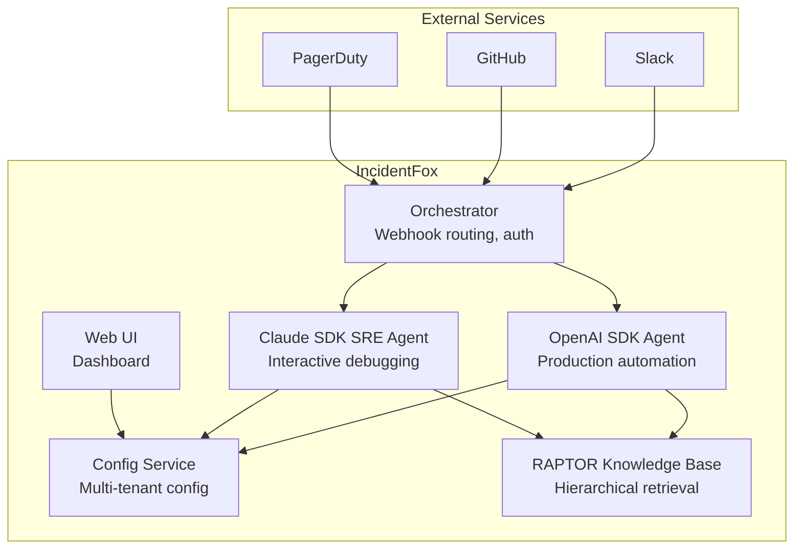
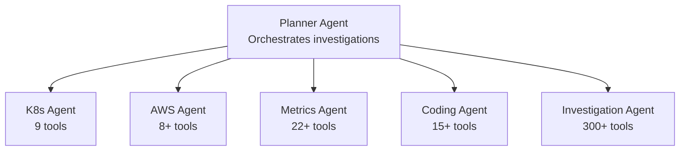
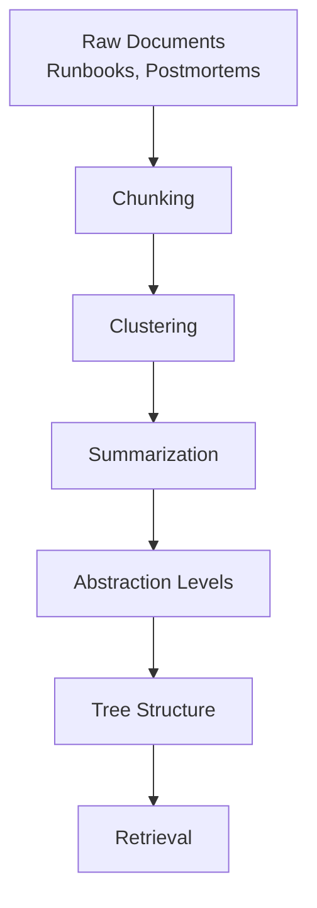
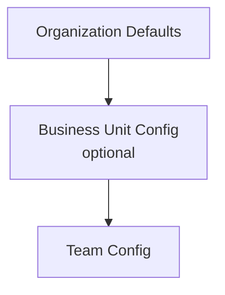
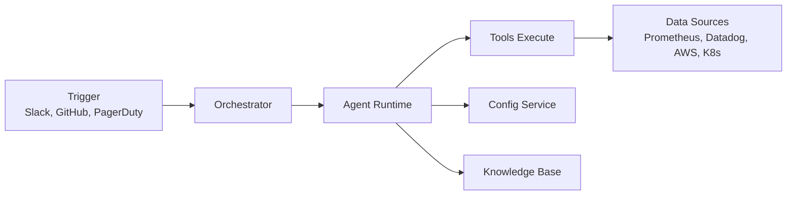
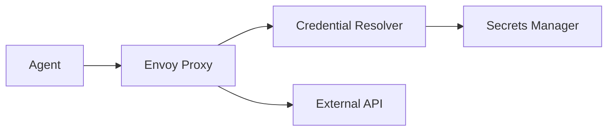

## Architecture Overview

IncidentFox uses a sophisticated dual-runtime architecture with two complementary agent systems:

1. **OpenAI SDK Agent** - Multi-agent orchestration for production automation
2. **Claude SDK SRE Agent** - Interactive debugging with Kubernetes sandbox isolation

Both systems share access to 300+ tools and the RAPTOR knowledge base.



## Dual Agent Runtimes

### OpenAI SDK Agent (Production Automation)

The production agent uses multi-agent orchestration where specialized agents collaborate:



**Key characteristics:**
- Automated investigation triggered by webhooks
- Multi-agent orchestration for parallel data gathering
- Optimized for production incident response
- Async execution with status updates

### Claude SDK SRE Agent (Interactive Debugging)

The interactive agent provides hands-on debugging with enhanced security:

**Key characteristics:**
- Kubernetes sandbox isolation with gVisor
- Interactive mode with interrupt/resume support
- Streaming responses for real-time feedback
- Credentials proxy (Envoy) - secrets never touch agent
- Ideal for complex, exploratory investigations

## The Agents

### Planner Agent

The Planner is the orchestrator. When you trigger an investigation, it:

1. **Analyzes the request** - Understands what you're asking
2. **Creates a plan** - Determines which agents and tools are needed
3. **Delegates tasks** - Assigns work to specialized agents
4. **Synthesizes results** - Combines findings into a coherent response

<Note>
The Planner doesn't execute tools directly. It coordinates other agents that have the specialized capabilities.
</Note>

### K8s Agent

Specializes in Kubernetes troubleshooting with 9 dedicated tools:

| Tool | Description |
|------|-------------|
| `get_pod_logs` | Fetch container logs from pods |
| `describe_pod` | Get pod status, events, and configuration |
| `list_pods` | List pods in a namespace with status |
| `get_pod_events` | Get Kubernetes events for pods |
| `describe_deployment` | Get deployment status and replica info |
| `get_deployment_history` | View rollout history |
| `describe_service` | Get service details and endpoints |
| `get_pod_resource_usage` | CPU/memory usage metrics |
| `propose_pod_restart` | Suggest pod restart with approval workflow |

### AWS Agent

Handles AWS infrastructure debugging with 8+ tools:

| Tool | Description |
|------|-------------|
| `describe_ec2_instance` | EC2 instance details and status |
| `get_cloudwatch_logs` | Fetch logs from CloudWatch Log Groups |
| `describe_lambda_function` | Lambda configuration and metrics |
| `get_rds_instance_status` | RDS database status and metrics |
| `query_cloudwatch_insights` | Run CloudWatch Insights queries |
| `get_cloudwatch_metrics` | Query CloudWatch metrics |
| `list_ecs_tasks` | List ECS Fargate tasks |
| `describe_codepipeline` | Get CodePipeline execution status |

### Metrics Agent

Focuses on anomaly detection and correlation with 22+ tools including:

- **Anomaly Detection** - Z-score, Prophet-based seasonal detection
- **Correlation Analysis** - Pearson correlation between metrics
- **Change Point Detection** - Identify when metrics behavior changed
- **Forecasting** - Prophet-based capacity planning
- **Trend Decomposition** - Separate trend, seasonality, and residuals

### Coding Agent

Handles code analysis and CI/CD with 15+ tools:

- **File Operations** - Read, search, and analyze code
- **Git Operations** - Diff, blame, log, recent changes analysis
- **GitHub Integration** - PR analysis, code search, commit correlation
- **Test Execution** - Run tests and analyze failures

### Investigation Agent

The "jack of all trades" agent with access to all 300+ tools. Used for complex, cross-domain investigations that require multiple types of analysis.

## RAPTOR Knowledge Base

IncidentFox uses RAPTOR (Recursive Abstractive Processing for Tree-Organized Retrieval), a hierarchical knowledge system based on ICLR 2024 research.

### Why RAPTOR?

Traditional RAG (Retrieval Augmented Generation) struggles with:
- Long documents (100+ page runbooks)
- Complex relationships between concepts
- Multi-level reasoning

RAPTOR solves this with hierarchical abstraction:



### Knowledge Types

| Level | Type | Description |
|-------|------|-------------|
| L1 | Procedural | Step-by-step runbooks |
| L2 | Factual | Service configurations, thresholds |
| L3 | Temporal | Past incidents, timelines |
| L4 | Policy | Escalation rules, SLAs |

### Knowledge Graph

Beyond tree structure, IncidentFox maintains a knowledge graph for:
- Service dependencies
- Team ownership
- Expertise mapping
- Related investigations

### Learning from Investigations

IncidentFox improves over time by:

1. **Recording patterns** - Stores cause-solution pairs from successful investigations
2. **Finding similar incidents** - Matches new issues to past investigations
3. **Importance scoring** - Uses 9+ signals to rank knowledge relevance
4. **Contextual boosts** - Adjusts relevance based on current investigation context

## Investigation Flow

Here's what happens when you trigger an investigation:

<Steps>
  <Step title="Trigger Received">
    User mentions `@incidentfox` in Slack with a request like "investigate high latency in payments service"
  </Step>
  <Step title="Knowledge Retrieval">
    RAPTOR retrieves relevant runbooks, past incidents, and service documentation
  </Step>
  <Step title="Planner Activates">
    The Planner agent analyzes the request and determines:
    - What systems might be involved (payments, database, etc.)
    - What data sources to query (logs, metrics, recent changes)
    - Which specialized agents to involve
  </Step>
  <Step title="Data Gathering">
    Specialized agents execute their tools in parallel:
    - K8s Agent checks pod status and logs
    - AWS Agent queries CloudWatch metrics
    - Metrics Agent runs anomaly detection
    - Git tools correlate with recent deployments
  </Step>
  <Step title="Correlation">
    The Investigation Agent correlates findings:
    - Timeline reconstruction
    - Root cause identification
    - Impact assessment (blast radius)
  </Step>
  <Step title="Response">
    Results are synthesized and posted back to Slack with:
    - Summary of findings
    - Root cause with confidence score
    - Evidence (logs, metrics, events)
    - Recommended actions
  </Step>
  <Step title="Learning">
    If the investigation was successful, patterns are recorded for future use
  </Step>
</Steps>

## Investigation Results

Investigations return structured results:

```json
{
  "success": true,
  "findings": "Payment service latency spike correlated with database connection exhaustion",
  "root_cause": "RDS connection pool at 100% capacity following deployment",
  "confidence": 92,
  "recommendations": [
    "Increase max_connections on RDS",
    "Review connection pool settings in app config"
  ],
  "phase_results": {
    "data_collection": "completed",
    "anomaly_detection": "completed",
    "root_cause_analysis": "completed",
    "impact_assessment": "completed"
  },
  "duration_seconds": 45.2
}
```

### Finding Types

| Type | Description |
|------|-------------|
| `metric_anomaly` | Unusual metric behavior detected |
| `log_error` | Error pattern in logs |
| `event` | System event correlation |
| `hypothesis` | Generated theory about root cause |
| `contradiction` | Conflicting evidence detected |

## Configuration Inheritance

IncidentFox uses hierarchical configuration that flows from organization to team level:



Each level can override settings from the level above. This allows:

- **Org-wide defaults** - Set sensible defaults for all teams
- **Business unit settings** - Configure for platform vs. application teams
- **Team overrides** - Fine-tune for specific team needs

### Example Configuration Flow

```json
// Organization level
{
  "mcp_servers": ["grafana", "aws"],
  "agents": {
    "investigation_agent": {
      "prompt": "You are an SRE investigation agent..."
    }
  }
}

// Team level override
{
  "mcp_servers": ["grafana", "aws", "coralogix"],  // Added coralogix
  "agents": {
    "investigation_agent": {
      "enable_extra_tools": ["snowflake"]  // Team-specific
    }
  }
}
```

The team's effective config merges both, so they get:
- All three MCP servers
- The org's base prompt
- The snowflake tool enabled

## Data Flow



1. **Triggers** send investigation requests to the Orchestrator
2. **Orchestrator** routes to appropriate agent runtime
3. **Config Service** provides team-specific configuration
4. **Knowledge Base** provides relevant context
5. **Tools** query external data sources
6. **Results** flow back through the agent to the trigger source

## Tool Loading

Tools are loaded dynamically based on:

1. **Installation** - Is the integration package installed?
2. **Configuration** - Are credentials configured?
3. **Team Settings** - Is the tool enabled for this team?

```python
# Example: Tool loading logic
if is_integration_available("coralogix"):
    if config.coralogix.api_key:
        if "coralogix" not in config.disabled_tools:
            load_coralogix_tools()
```

This means teams only see tools relevant to their stack.

## MCP Integration

IncidentFox supports the [Model Context Protocol (MCP)](https://modelcontextprotocol.io/) for extending capabilities with custom tools.

### What is MCP?

MCP is an open protocol that allows AI agents to access external tools and data sources in a standardized way. IncidentFox is compatible with 100+ MCP servers.

### Using MCP with IncidentFox

1. **Configure MCP servers** at org or team level
2. **Tools auto-load** without code changes
3. **Agents automatically** discover and use MCP tools during investigations

```json
{
  "mcp_servers": [
    {
      "name": "internal-tools",
      "url": "mcps://tools.internal.company.com",
      "auth": "vault://secrets/mcp-token"
    }
  ]
}
```

### MCP Inheritance

MCP servers configured at the organization level are inherited by all teams. Teams can add additional servers specific to their needs.

## Security Architecture

### Credentials Proxy

Secrets never touch the agent directly:



1. Agent makes API call through Envoy proxy
2. Envoy intercepts and injects credentials at request time
3. Secrets are never stored in agent memory

### Claude Sandbox Isolation

The Claude SDK SRE Agent runs in an isolated Kubernetes environment:

- **gVisor** - User-space kernel for container isolation
- **Network policies** - Restricted egress
- **Resource limits** - CPU, memory, and time bounds
- **Ephemeral** - Sandboxes destroyed after investigation

## Next Steps

<CardGroup cols={2}>
  <Card title="Configuration" icon="sliders" href="/configuration/overview">
    Learn how to configure agents and tools
  </Card>
  <Card title="Data Sources" icon="database" href="/data-sources/overview">
    Connect your observability stack
  </Card>
  <Card title="Knowledge Base" icon="brain" href="/knowledge-base">
    Configure RAPTOR and teach custom knowledge
  </Card>
  <Card title="Security" icon="shield" href="/security">
    Understand security architecture
  </Card>
</CardGroup>
