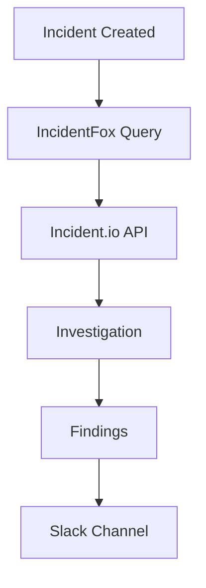

<iframe
  width="560"
  height="315"
  src="https://player.vimeo.com/video/1161602255"
  title="Setting up Incident.io Integration"
  frameborder="0"
  allow="autoplay; fullscreen; picture-in-picture"
  allowfullscreen
></iframe>

## Overview

Incident.io integration enables IncidentFox to:

- Automatically investigate when incidents are created
- Post findings to incident channels
- Enrich incident timelines with investigation data
- Correlate incidents with recent changes
- Access incident history and context

## Prerequisites

- Incident.io account with API access
- API key with read permissions
- Slack integration configured (for responses)

## Configuration

### Step 1: Create an Incident.io API Key

1. Go to your incident.io home dashboard
2. Click the settings gear icon at the bottom of the left navbar (next to your name)
3. Scroll down to the *Extend* section and click *API keys*
4. Click *Add New* (top right)
5. Click *View data...* (the first permission option)
6. Name your API key appropriately, scroll down, and click *Create*
7. Copy the API key

### Step 2: Connect to IncidentFox

<Tip>
See [Configuring Data Sources](/integrations/slack#configuring-data-sources) for general instructions on opening the configuration panel in Slack.
</Tip>

1. Open the IncidentFox app in Slack (click the bot's avatar → **Open App**)
2. Under **Available Integrations**, find Incident.io and click **Connect** (or **Edit** if already configured)
3. In the modal:
   - Watch the **video walkthrough** for step-by-step guidance
   - Paste your **API Key**
   - Optionally, add **Custom Context** to help the AI understand your incident.io setup (e.g., team structure, service names, escalation patterns)
4. Click **Save**

### Custom Context for AI (Optional)

The **Context for AI** field lets you provide additional information that helps IncidentFox investigate more effectively. Examples:

- "Our critical services are `payments-api`, `checkout-service`, and `user-auth`"
- "High severity incidents automatically page the SRE on-call team"
- "We use incident.io custom fields for service ownership and deployment tracking"

This context is provided to the AI during investigations to help it understand your incident management workflow.

## Available Tools

Once configured, these tools become available:

### `get_incident_details`

Retrieve detailed information about a specific incident.

```
@incidentfox get details for incident INC-123
```

**Parameters:**
- `incident_id` - Incident identifier
- `include_timeline` - Include timeline events (optional)

### `list_recent_incidents`

Get a list of recent incidents with filtering options.

```
@incidentfox show recent incidents for the checkout service
```

**Parameters:**
- `service` - Filter by service (optional)
- `severity` - Filter by severity (optional)
- `status` - Active, resolved, all
- `time_range` - Time range to search

### `correlate_incidents`

Find similar or related incidents based on services, error patterns, or timing.

```
@incidentfox find similar incidents to the current database timeout issue
```

**Parameters:**
- `incident_id` - Reference incident
- `similarity_threshold` - Match confidence level
- `time_range` - How far back to search

## How It Works



1. **Incident created** in Incident.io
2. **IncidentFox queries** incident details via API
3. **Investigation starts** with incident context
4. **Findings posted** to incident Slack channel
5. **Timeline optionally updated** with investigation summary

## Automatic Investigation

When an incident is created, IncidentFox:

1. **Extracts context** from incident title and description
2. **Identifies services** mentioned in the incident
3. **Queries data sources** for relevant logs/metrics
4. **Correlates with changes** in the last 4 hours
5. **Posts findings** to the incident channel

### Example

**Incident created:**
```
Title: High error rate on checkout service
Description: PagerDuty alert fired. Customers reporting failed checkouts.
```

**IncidentFox response (in incident channel):**
```
Investigation Started

Context: High error rate detected on checkout-service
Severity: High
Investigating...

---

Preliminary Findings:

Summary: Checkout service experiencing 503 errors due to
upstream dependency failure.

Root Cause (Confidence: 87%):
• Payment gateway returning timeout errors
• Started at 14:32 UTC
• Correlates with payment-gateway deploy at 14:30

Evidence:
• Error logs: "upstream connect error: connection timeout"
• 99.9th percentile latency: 30s (normal: 200ms)
• Payment gateway pod restarted 3 times

Recommended Actions:
1. Check payment-gateway pod logs
2. Consider rollback of payment-gateway deployment
3. Enable circuit breaker if not already active

Timeline:
• 14:30 - payment-gateway v2.1.0 deployed
• 14:32 - First timeout errors
• 14:35 - Error rate exceeded threshold
• 14:36 - PagerDuty alert fired
• 14:36 - This incident created
```

## Timeline Integration

IncidentFox can automatically add entries to your Incident.io timeline during investigations:

- **Investigation started** - When IncidentFox begins analyzing an incident
- **Root cause identified** - When high-confidence findings are detected
- **Investigation complete** - Final summary with recommendations

These timeline entries help maintain a chronological record of the investigation process alongside your manual incident updates.

## Severity Mapping

| Incident.io Severity | IncidentFox Priority |
|---------------------|---------------------|
| Critical | P0 |
| High | P1 |
| Medium | P2 |
| Low | P3 |

## Use Cases

### Historical Context During Incidents

```
@incidentfox check if we've had similar incidents to this checkout error
```

IncidentFox will:
- Search incident history for similar patterns
- Identify common root causes
- Reference previous resolutions

### Post-Incident Analysis

```
@incidentfox analyze incidents from the last quarter for the payments service
```

### Incident Correlation

```
@incidentfox check if the current incident correlates with recent deployments
```

## Best Practices

<Tip>
**Include service names and error patterns** in incident descriptions to help IncidentFox find relevant historical data.
</Tip>

1. **Use consistent service naming** across incident.io and your infrastructure
2. **Tag incidents properly** for better correlation
3. **Add PagerDuty context** when creating incidents
4. **Use structured descriptions** for better parsing
5. **Review similar incidents** before diving into investigation

## Security Considerations

### What IncidentFox Can Access

The API key with "View data" permissions grants these **read-only** capabilities:

| Permission | Purpose |
|------------|---------|
| View incidents | Access incident details and history |
| View timelines | Read incident timeline events |
| View custom fields | Access service metadata |
| View users and teams | Understand on-call assignments |

### What IncidentFox Cannot Do

- Create, modify, or delete incidents
- Change incident status or severity
- Update postmortems or retrospectives
- Manage API keys or users
- Access or modify workflows
- Change team settings

### Best Practices

- **All permissions are read-only** - no write or management access
- **You control the key** - revoke anytime from your incident.io dashboard
- **No data storage** - IncidentFox queries on-demand; data stays in incident.io
- Store keys in your secrets manager
- Rotate keys periodically
- Monitor API usage for anomalies

### Revoking Access

To revoke IncidentFox's access at any time:

1. Go to your incident.io home dashboard
2. Click the settings gear icon at the bottom of the left navbar
3. Navigate to *Extend* > *API keys*
4. Find the IncidentFox key and click **Delete**

## Troubleshooting

### Connection Failed

**Symptom:** "Unable to connect to Incident.io API"

**Solutions:**
1. Verify API key is valid and not expired
2. Check that "View data" permission was granted
3. Ensure network allows outbound HTTPS to incident.io

### Missing Incident Data

**Symptom:** IncidentFox can't find incidents

**Solutions:**
1. Verify incident IDs are correct
2. Check time range - incidents may be outside the range
3. Ensure service names match those used in incident.io

### Rate Limiting

**Symptom:** "Rate limit exceeded" errors

**Solutions:**
1. Reduce query frequency
2. Use more specific filters (service, severity, time range)
3. Contact incident.io support to increase limits

## Next Steps

<CardGroup cols={2}>
  <Card title="PagerDuty" icon="bell" href="/integrations/pagerduty">
    Connect PagerDuty
  </Card>
  <Card title="Slack" icon="slack" href="/integrations/slack">
    Configure Slack responses
  </Card>
</CardGroup>
