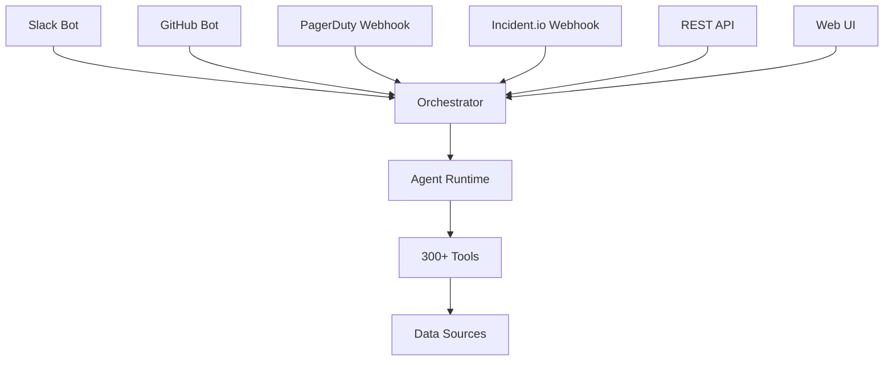

## Overview

IncidentFox integrates with your existing collaboration and incident management tools to provide seamless investigation workflows.

## Trigger Integrations

These integrations allow you to invoke IncidentFox:

| Integration | Trigger Method | Use Case |
|-------------|---------------|----------|
| [Slack](/integrations/slack) | @mention bot | General investigations, ad-hoc queries |
| [GitHub](/integrations/github) | @mention in PR/issue | CI/CD failures, code-related issues |
| [PagerDuty](/integrations/pagerduty) | Webhook on alert | Automatic incident investigation |
| [Incident.io](/integrations/incident-io) | Webhook on incident | Integrated incident response |
| [REST API](/api-reference/introduction) | HTTP POST | Programmatic access, custom workflows |
| [Web UI](/integrations/web-ui) | Dashboard | Manual investigations, configuration |

## Alerting Integrations

These integrations provide alert context and correlation:

| Integration | Capabilities |
|-------------|-------------|
| [Prometheus/Alertmanager](/integrations/prometheus) | Alert rules, firing alerts, silence management |
| [Opsgenie](/integrations/opsgenie) | Alert management, escalation |

## Collaboration Integrations

| Integration | Capabilities |
|-------------|-------------|
| [Slack](/integrations/slack) | Messages, channel history, threads, posting |
| [Microsoft Teams](/integrations/teams) | Messages, channels |
| [Linear](/integrations/linear) | Issue tracking, project management |
| [Jira](/integrations/jira) | Ticket creation, issue tracking |

## Integration Architecture

## Quick Setup

<Steps>
  <Step title="Choose Your Integrations">
    Most teams start with Slack for general use, then add GitHub for CI/CD workflows.
  </Step>
  <Step title="Install the App">
    Follow the setup guide for each integration to install the necessary apps/webhooks.
  </Step>
  <Step title="Configure Permissions">
    Grant IncidentFox appropriate read permissions for your channels/repos.
  </Step>
  <Step title="Test the Connection">
    Send a test message or trigger to verify the integration works.
  </Step>
</Steps>

## Integration Comparison

| Feature | Slack | GitHub | PagerDuty | Incident.io | Web UI | REST API |
|---------|-------|--------|-----------|-------------|--------|----------|
| Manual trigger | Yes | Yes | No | No | Yes | Yes |
| Auto-trigger on alert | No | No | Yes | Yes | No | Yes |
| Response in same tool | Yes | Yes | Via Slack | Via Slack | Yes | JSON |
| Rich formatting | Yes | Yes | Yes | Yes | Yes | N/A |
| Thread support | Yes | Yes | N/A | N/A | N/A | N/A |
| Interactive mode | Yes | No | No | No | Yes | Yes |
| Streaming responses | Yes | No | No | No | Yes | Yes |

## Recommended Setup

### For General SRE Teams

1. **Slack** - Primary interface for investigations
2. **PagerDuty** - Auto-investigate on alerts
3. **GitHub** - For deployment correlations

### For Development Teams

1. **Slack** - Quick queries and debugging
2. **GitHub** - CI/CD failure analysis
3. **PagerDuty** - Production alert context

### For Platform Teams

1. **Slack** - General investigations
2. **Incident.io** - Formal incident response
3. **All data sources** - Comprehensive access

## Next Steps

<CardGroup cols={2}>
  <Card title="Slack" icon="slack" href="/integrations/slack">
    Set up Slack bot
  </Card>
  <Card title="GitHub" icon="github" href="/integrations/github">
    Configure GitHub integration
  </Card>
  <Card title="PagerDuty" icon="bell" href="/integrations/pagerduty">
    Connect PagerDuty
  </Card>
  <Card title="Incident.io" icon="siren" href="/integrations/incident-io">
    Set up Incident.io
  </Card>
  <Card title="Prometheus" icon="chart-line" href="/integrations/prometheus">
    Connect Prometheus/Alertmanager
  </Card>
  <Card title="Web UI" icon="browser" href="/integrations/web-ui">
    Use the dashboard
  </Card>
</CardGroup>
