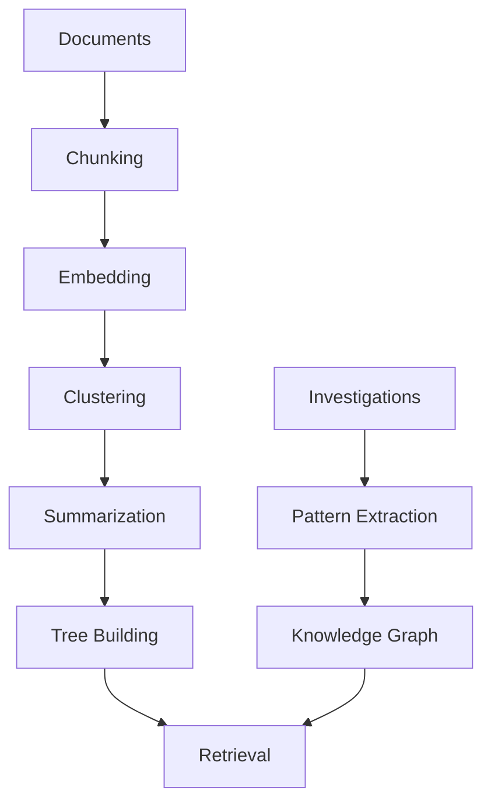

## Overview

IncidentFox uses RAPTOR (Recursive Abstractive Processing for Tree-Organized Retrieval), a state-of-the-art hierarchical knowledge system based on ICLR 2024 research. This enables handling 100+ page runbooks without context loss.

## Why RAPTOR?

Traditional RAG (Retrieval Augmented Generation) struggles with:

| Challenge | Traditional RAG | RAPTOR |
|-----------|----------------|--------|
| Long documents | Loses context | Hierarchical abstraction |
| Complex relationships | Flat retrieval | Multi-level reasoning |
| Cross-document queries | Limited | Knowledge graph |
| Learning over time | Static | Pattern recording |

## Architecture



## Knowledge Types

RAPTOR organizes knowledge into abstraction levels:

| Level | Type | Examples |
|-------|------|----------|
| L1 | Procedural | Step-by-step runbooks, remediation steps |
| L2 | Factual | Service configurations, thresholds, SLAs |
| L3 | Temporal | Past incidents, deployment history |
| L4 | Policy | Escalation rules, on-call rotations |

## Adding Knowledge

### Via API

```bash
curl -X POST https://api.incidentfox.ai/api/v1/kb/teach \
  -H "Authorization: Bearer $TEAM_TOKEN" \
  -H "Content-Type: application/json" \
  -d '{
    "content": "When the payments service shows high latency...",
    "type": "runbook",
    "service": "payments",
    "tags": ["latency", "database"]
  }'
```

### Via Slack

```
@incidentfox learn: When the checkout service returns 503 errors,
first check the Redis cluster health, then verify the connection pool settings.
```

### Via Web UI

1. Navigate to **Knowledge Base** > **Add Knowledge**
2. Paste or upload content
3. Tag with services and categories
4. Submit for processing

## Document Sources

IncidentFox can ingest knowledge from:

| Source | Method |
|--------|--------|
| Confluence | API integration |
| Google Docs | OAuth connection |
| Notion | API integration |
| Markdown files | Direct upload |
| Past incidents | Automatic extraction |

### Confluence Integration

```json
{
  "knowledge_base": {
    "sources": {
      "confluence": {
        "url": "https://your-company.atlassian.net",
        "space_keys": ["SRE", "PLATFORM"],
        "sync_interval": "1h"
      }
    }
  }
}
```

## Knowledge Graph

Beyond tree structure, RAPTOR maintains a knowledge graph:

### Relationships

| Relationship | Description |
|--------------|-------------|
| `depends_on` | Service dependencies |
| `owned_by` | Team ownership |
| `expert_in` | Individual expertise |
| `related_to` | Related incidents/runbooks |

### Querying the Graph

```
@incidentfox who owns the payments service and what does it depend on?
```

## Learning from Investigations

IncidentFox automatically learns from successful investigations:

### Pattern Recording

After each investigation:

1. Extracts cause-solution pairs
2. Tags with services and symptoms
3. Stores in knowledge base
4. Increases confidence with repetition

### Example Pattern

```json
{
  "pattern_id": "pat_12345",
  "symptoms": ["high latency", "connection timeout"],
  "root_cause": "Database connection pool exhaustion",
  "solution": "Increase max_connections and restart service",
  "confidence": 0.85,
  "occurrences": 5
}
```

### Finding Similar Investigations

```
@incidentfox have we seen this issue before?
```

IncidentFox searches for:
- Similar symptoms
- Same services
- Related error patterns

## Importance Scoring

RAPTOR uses 9+ signals to rank knowledge relevance:

| Signal | Weight | Description |
|--------|--------|-------------|
| Recency | High | Recently updated knowledge |
| Usage | High | Frequently referenced |
| Confidence | Medium | Verification status |
| Service match | High | Relevant to current service |
| Symptom match | High | Matches current symptoms |
| Author expertise | Medium | Written by domain expert |
| Freshness decay | Dynamic | Older knowledge decays |
| Contextual boost | Dynamic | Current investigation context |
| Feedback | Medium | User feedback signals |

## Configuration

### RAPTOR Settings

```json
{
  "knowledge_base": {
    "raptor": {
      "chunk_size": 512,
      "cluster_threshold": 0.8,
      "max_tree_depth": 4,
      "embedding_model": "text-embedding-3-large"
    }
  }
}
```

### Retrieval Settings

```json
{
  "knowledge_base": {
    "retrieval": {
      "strategy": "hybrid",  // "dense", "sparse", or "hybrid"
      "reranker": "cohere",
      "top_k": 10,
      "min_relevance": 0.7
    }
  }
}
```

## API Endpoints

### Retrieve Knowledge

```bash
POST /api/v1/kb/retrieve
{
  "query": "how to handle checkout service outage",
  "service": "checkout",
  "top_k": 5
}
```

### Get Answer with Sources

```bash
POST /api/v1/kb/answer
{
  "question": "What is the escalation path for P1 incidents?",
  "include_sources": true
}
```

### Provide Feedback

```bash
POST /api/v1/kb/feedback
{
  "query_id": "q_12345",
  "helpful": true,
  "comment": "This runbook was exactly what I needed"
}
```

### Tree Statistics

```bash
GET /api/v1/kb/tree/stats
```

Returns:
- Total documents
- Tree depth
- Node counts by level
- Last sync time

## Best Practices

### Document Quality

- Keep runbooks up to date
- Include specific commands and thresholds
- Add examples and expected outcomes
- Tag with relevant services

### Feedback Loop

- Provide feedback on retrieved knowledge
- Flag outdated information
- Suggest improvements

### Service Tagging

Tag all knowledge with:
- Service name
- Environment (prod, staging)
- Category (runbook, alert, architecture)

## Troubleshooting

### Knowledge Not Retrieved

1. Check document is indexed: `GET /api/v1/kb/status`
2. Verify tagging and metadata
3. Check relevance threshold settings

### Stale Knowledge

1. Set up automatic sync from sources
2. Configure freshness decay
3. Regularly review and update

## Next Steps

<CardGroup cols={2}>
  <Card title="How It Works" icon="brain" href="/how-it-works">
    See RAPTOR in the full architecture
  </Card>
  <Card title="Configuration" icon="sliders" href="/configuration/overview">
    Configure knowledge settings
  </Card>
</CardGroup>
