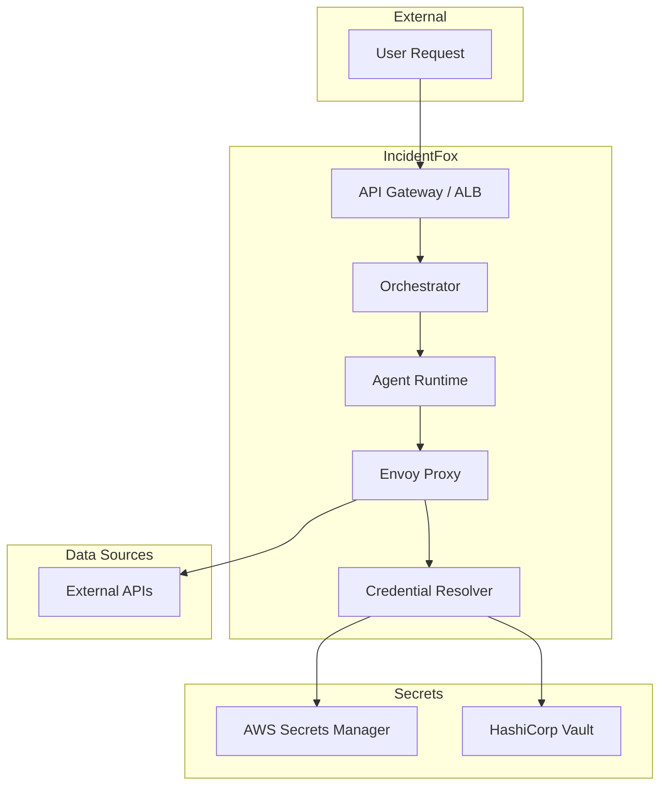

## Overview

IncidentFox is built with enterprise security as a core principle. This document covers the security architecture, compliance certifications, and best practices for secure deployment.

## Security Architecture



## Credentials Proxy

**Secrets never touch the agent.** IncidentFox uses an Envoy-based credentials proxy:

1. Agent makes API call through Envoy proxy
2. Envoy intercepts the request
3. Credential Resolver fetches secrets from vault
4. Envoy injects credentials at request time
5. Request is forwarded to external API
6. Secrets are never stored in agent memory

### Benefits

| Traditional Approach | IncidentFox Approach |
|---------------------|---------------------|
| Agent stores secrets | Secrets in proxy only |
| Risk of memory exposure | Isolated credential handling |
| Static credentials | Dynamic credential injection |
| Audit gaps | Full audit trail |

## Claude Sandbox Isolation

The Claude SDK SRE Agent runs in isolated Kubernetes sandboxes:

### gVisor Isolation

- User-space kernel intercepts all syscalls
- Reduced kernel attack surface
- Container-to-host isolation

### Network Policies

```yaml
apiVersion: networking.k8s.io/v1
kind: NetworkPolicy
metadata:
  name: agent-sandbox
spec:
  podSelector:
    matchLabels:
      app: sre-agent
  policyTypes:
    - Egress
  egress:
    - to:
        - namespaceSelector:
            matchLabels:
              name: incidentfox
    - ports:
        - port: 443  # HTTPS only
```

### Resource Limits

- CPU: Bounded to prevent runaway processes
- Memory: Capped to prevent OOM attacks
- Time: Maximum investigation duration
- Ephemeral: Sandbox destroyed after use

## Authentication

### Token Types

| Type | Format | Scope | Expiration |
|------|--------|-------|------------|
| Global Admin | `ADMIN_TOKEN` env var | Full access | Never |
| Org Admin | `{org_id}.{random}` | Organization | Configurable |
| Team Token | `{org_id}.{team_id}.{random}` | Team only | Configurable |
| OIDC JWT | Standard JWT | User session | Short-lived |

### SSO/OIDC Support

Supported identity providers:
- Google Workspace
- Azure AD / Entra ID
- Okta
- Generic OIDC

### Configuration

```json
{
  "auth": {
    "oidc": {
      "issuer": "https://accounts.google.com",
      "client_id": "your-client-id",
      "allowed_domains": ["your-company.com"]
    }
  }
}
```

## Authorization (RBAC)

### Roles

| Role | Permissions |
|------|-------------|
| Viewer | Read investigations, view dashboards |
| Operator | Trigger investigations, view all data |
| Admin | Configure tools, manage team settings |
| Org Admin | Manage teams, configure org settings |

### Tool-Level Permissions

Restrict access to sensitive tools:

```json
{
  "tools": {
    "docker_exec": {
      "enabled": true,
      "allowed_roles": ["admin"],
      "require_approval": true
    }
  }
}
```

## Approval Workflows

For high-risk operations, require approval:

```json
{
  "approval_workflows": {
    "enabled": true,
    "actions": {
      "pod_restart": {
        "required_approvers": 1,
        "timeout_minutes": 30,
        "notify_channel": "#sre-approvals"
      },
      "scale_deployment": {
        "required_approvers": 2,
        "timeout_minutes": 15
      }
    }
  }
}
```

### Approval Flow

1. Agent proposes action
2. Notification sent to approvers
3. Approver reviews and approves/denies
4. Action executed or cancelled

## Audit Logging

All operations are logged:

### Event Types

| Event | Logged Data |
|-------|-------------|
| Investigation started | User, query, timestamp |
| Tool executed | Tool name, parameters, result status |
| Data accessed | Data source, query, row count |
| Configuration changed | Old value, new value, user |
| Approval requested/granted | Action, approver, decision |

### Log Format

```json
{
  "timestamp": "2024-01-15T14:30:00Z",
  "event_type": "tool_executed",
  "user_id": "user@company.com",
  "team_id": "team_123",
  "tool": "get_pod_logs",
  "parameters": {
    "namespace": "production",
    "pod": "api-server-xyz"
  },
  "duration_ms": 1234,
  "status": "success"
}
```

### Log Destinations

- CloudWatch Logs
- Datadog
- Splunk
- Custom webhook

## Compliance

### SOC 2 Type II

IncidentFox maintains SOC 2 Type II certification:

| Control | Implementation |
|---------|----------------|
| Access Control | RBAC, SSO, MFA |
| Encryption | TLS 1.3, AES-256 at rest |
| Logging | Comprehensive audit trail |
| Monitoring | Real-time alerting |
| Incident Response | Documented procedures |

### Data Handling

| Data Type | Handling |
|-----------|----------|
| Investigation queries | Logged, retained 90 days |
| Tool results | Not stored (passed through) |
| Credentials | Never stored in agent |
| Audit logs | Retained per policy |

## Deployment Security

### Self-Hosted

For maximum control:

- Deploy in your VPC
- Use your secrets manager
- Control all network egress
- Manage your own keys

### Air-Gapped

For highly restricted environments:

- No external network access
- Local model inference
- Internal secrets management
- Manual updates

## Best Practices

### Credential Management

1. Use vault references, never plain text
2. Rotate credentials regularly
3. Use service accounts with minimal permissions
4. Enable audit logging for secret access

### Network Security

1. Use private endpoints where possible
2. Enable VPC peering for cloud services
3. Restrict agent egress to necessary destinations
4. Use TLS for all communications

### Access Control

1. Enable SSO for all users
2. Use team-scoped tokens
3. Require MFA for admin access
4. Regular access reviews

### Monitoring

1. Alert on authentication failures
2. Monitor for unusual tool usage
3. Track investigation patterns
4. Review audit logs regularly

## Incident Response

### Security Incidents

If you discover a security issue:

1. Email security@incidentfox.ai
2. Do not disclose publicly
3. We will respond within 24 hours

### Vulnerability Disclosure

We follow responsible disclosure:
- 90-day disclosure timeline
- Credit for reporters
- Bug bounty program available

## Next Steps

<CardGroup cols={2}>
  <Card title="Configuration" icon="sliders" href="/configuration/overview">
    Configure security settings
  </Card>
  <Card title="API Authentication" icon="key" href="/api-reference/authentication">
    API authentication details
  </Card>
</CardGroup>
