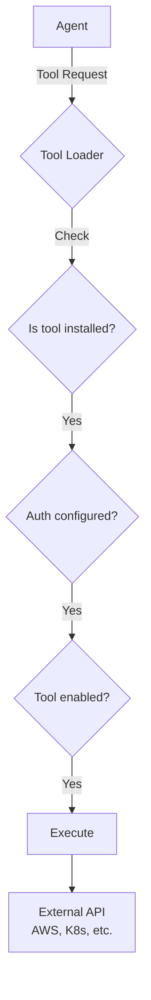

## Overview

IncidentFox provides 50+ built-in tools across multiple categories. These tools enable agents to interact with your infrastructure and observability stack.

## Tool Categories

| Category | Tools | Description |
|----------|-------|-------------|
| [Kubernetes](/tools/kubernetes) | 9 | Pod logs, deployments, events, resource usage |
| [AWS](/tools/aws) | 8 | EC2, Lambda, RDS, ECS, CloudWatch |
| [Observability](/tools/observability) | 15+ | Grafana, Datadog, Coralogix, New Relic |
| [GitHub](/tools/github) | 16 | Code search, PRs, issues, Actions |
| [Custom MCP](/tools/custom-mcp) | Unlimited | Add your own tools via MCP |

## Tool Distribution by Agent

| Agent | Tools | Purpose |
|-------|-------|---------|
| Planner | None | Planning only, delegates to others |
| K8s Agent | 9 | Kubernetes troubleshooting |
| AWS Agent | 8 | AWS resource debugging |
| Metrics Agent | 22 | Anomaly detection, correlation |
| Coding Agent | 15 | Code analysis, CI/CD |
| Investigation Agent | 30+ | All tools (dynamic) |

## How Tools Work



## Tool Loading

Tools are loaded dynamically based on:

1. **Integration Installed** - Is the package available?
2. **Credentials Configured** - Are API keys set?
3. **Team Settings** - Is the tool enabled?

Example log output:

```
slack_tools_loaded: count=4
github_tools_loaded: count=16
kubernetes_tools_loaded: count=9
aws_tools_loaded: count=8
```

## Configuring Tools

### Enable/Disable

```json
{
  "tools": {
    "kubernetes": {
      "enabled": true
    },
    "docker_exec": {
      "enabled": false
    }
  }
}
```

### Per-Agent Configuration

```json
{
  "agents": {
    "investigation_agent": {
      "disable_default_tools": ["shell", "docker_exec"],
      "enable_extra_tools": ["custom_runbook_search"]
    }
  }
}
```

## Tool Metrics

All tools track:

- `tool_calls_total{tool_name, status}` - Call count
- `tool_duration_seconds{tool_name}` - Execution time

View in Prometheus or the Web UI under **Agent Runs**.

## Common Tools

### Most Used for Investigations

| Tool | Category | Description |
|------|----------|-------------|
| `get_pod_logs` | Kubernetes | Fetch container logs |
| `get_cloudwatch_logs` | AWS | Query CloudWatch logs |
| `search_coralogix_logs` | Observability | Search Coralogix |
| `query_prometheus` | Observability | Query Grafana/Prometheus |
| `search_github_code` | GitHub | Search across repos |

### Most Used for CI/CD

| Tool | Category | Description |
|------|----------|-------------|
| `get_github_actions_logs` | GitHub | CI build logs |
| `describe_codepipeline` | AWS | Pipeline status |
| `read_github_file` | GitHub | Read code files |
| `git_diff` | Git | Show changes |

## Next Steps

<CardGroup cols={2}>
  <Card title="Kubernetes Tools" icon="dharmachakra" href="/tools/kubernetes">
    K8s troubleshooting tools
  </Card>
  <Card title="AWS Tools" icon="aws" href="/tools/aws">
    AWS infrastructure tools
  </Card>
  <Card title="Observability Tools" icon="chart-line" href="/tools/observability">
    Metrics and logging tools
  </Card>
  <Card title="Custom MCP Tools" icon="puzzle-piece" href="/tools/custom-mcp">
    Add your own tools
  </Card>
</CardGroup>
