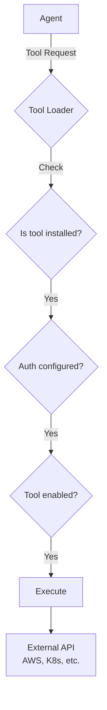

## Overview

IncidentFox provides 300+ built-in tools across 20+ categories. These tools enable agents to interact with your infrastructure, observability stack, databases, and collaboration platforms.

## Tool Categories

| Category | Tools | Description |
|----------|-------|-------------|
| [Kubernetes](/tools/kubernetes) | 9 | Pod logs, deployments, events, resource usage |
| [AWS](/tools/aws) | 8+ | EC2, Lambda, RDS, ECS, CloudWatch |
| [Docker](/tools/docker) | 15 | Container logs, stats, exec, events, inspect |
| [Observability](/tools/observability) | 15+ | Grafana, Datadog, Prometheus, Coralogix, New Relic |
| [Log Analysis](/tools/log-analysis) | 7 | Statistics, sampling, pattern search, anomaly detection |
| [Anomaly Detection](/tools/anomaly-detection) | 8 | Z-score, Prophet, correlation, change points |
| [GitHub](/tools/github) | 16 | Code search, PRs, issues, Actions, commits |
| [Git](/tools/git) | 12 | Diff, log, blame, branches, tags |
| [Database](/tools/database) | 70+ | MySQL, PostgreSQL, Snowflake, BigQuery |
| [PagerDuty](/tools/pagerduty) | 12 | Incidents, escalations, MTTR |
| [Sentry](/tools/sentry) | 4 | Issues, project stats, releases |
| [Slack](/tools/slack) | 5 | Search, channel history, post messages |
| [Custom MCP](/tools/custom-mcp) | Unlimited | Add your own tools via MCP (100+ compatible servers) |

## Tool Distribution by Runtime

IncidentFox uses dual agent runtimes, each with access to different tool sets:

### OpenAI SDK Agent (Production Automation)

| Agent | Tools | Purpose |
|-------|-------|---------|
| Planner | Orchestration | Coordinates specialists, creates investigation plans |
| K8s Agent | 9 | Kubernetes troubleshooting |
| AWS Agent | 8+ | AWS resource debugging |
| Metrics Agent | 22+ | Anomaly detection, correlation, forecasting |
| Coding Agent | 15+ | Code analysis, CI/CD |
| Investigation Agent | 300+ | All tools (dynamic loading) |

### Claude SDK SRE Agent (Interactive Debugging)

| Feature | Description |
|---------|-------------|
| K8s Sandbox | Isolated Kubernetes environment with gVisor |
| All Tools | Full access to 300+ tools |
| Interactive | Supports interrupt/resume during investigations |
| Streaming | Real-time response streaming |

## How Tools Work



## Tool Loading

Tools are loaded dynamically based on:

1. **Integration Installed** - Is the package available?
2. **Credentials Configured** - Are API keys set?
3. **Team Settings** - Is the tool enabled?

Example log output:

```
slack_tools_loaded: count=4
github_tools_loaded: count=16
kubernetes_tools_loaded: count=9
aws_tools_loaded: count=8
```

## Configuring Tools

### Enable/Disable

```json
{
  "tools": {
    "kubernetes": {
      "enabled": true
    },
    "docker_exec": {
      "enabled": false
    }
  }
}
```

### Per-Agent Configuration

```json
{
  "agents": {
    "investigation_agent": {
      "disable_default_tools": ["shell", "docker_exec"],
      "enable_extra_tools": ["custom_runbook_search"]
    }
  }
}
```

## Tool Metrics

All tools track:

- `tool_calls_total{tool_name, status}` - Call count
- `tool_duration_seconds{tool_name}` - Execution time

View in Prometheus or the Web UI under **Agent Runs**.

## Common Tools

### Most Used for Investigations

| Tool | Category | Description |
|------|----------|-------------|
| `get_pod_logs` | Kubernetes | Fetch container logs |
| `get_cloudwatch_logs` | AWS | Query CloudWatch logs |
| `search_logs` | Log Analysis | Universal log search across backends |
| `query_prometheus` | Observability | Query Grafana/Prometheus |
| `detect_anomalies` | Anomaly Detection | Find unusual patterns in metrics |
| `search_github_code` | GitHub | Search across repos |

### Most Used for CI/CD

| Tool | Category | Description |
|------|----------|-------------|
| `get_github_actions_logs` | GitHub | CI build logs |
| `describe_codepipeline` | AWS | Pipeline status |
| `read_github_file` | GitHub | Read code files |
| `git_diff` | Git | Show changes |
| `correlate_with_deployment` | Git | Link issues to recent deploys |

### Most Used for Log Analysis

| Tool | Category | Description |
|------|----------|-------------|
| `log_get_statistics` | Log Analysis | Get log volume and error rate stats |
| `log_sample` | Log Analysis | Sample logs for pattern discovery |
| `log_search_pattern` | Log Analysis | Regex pattern search |
| `log_around_timestamp` | Log Analysis | Get context around an event |
| `log_extract_signatures` | Log Analysis | Identify recurring error patterns |

### Most Used for Anomaly Detection

| Tool | Category | Description |
|------|----------|-------------|
| `detect_anomalies` | Anomaly Detection | Z-score statistical detection |
| `prophet_detect_anomalies` | Anomaly Detection | Seasonal anomaly detection |
| `find_change_point` | Anomaly Detection | Identify when issues started |
| `correlate_metrics` | Anomaly Detection | Find relationships between metrics |
| `forecast_metric` | Anomaly Detection | Capacity planning forecasts |

## Next Steps

<CardGroup cols={2}>
  <Card title="Kubernetes Tools" icon="dharmachakra" href="/tools/kubernetes">
    K8s troubleshooting tools
  </Card>
  <Card title="AWS Tools" icon="aws" href="/tools/aws">
    AWS infrastructure tools
  </Card>
  <Card title="Observability Tools" icon="chart-line" href="/tools/observability">
    Metrics and logging tools
  </Card>
  <Card title="Custom MCP Tools" icon="puzzle-piece" href="/tools/custom-mcp">
    Add your own tools
  </Card>
</CardGroup>
